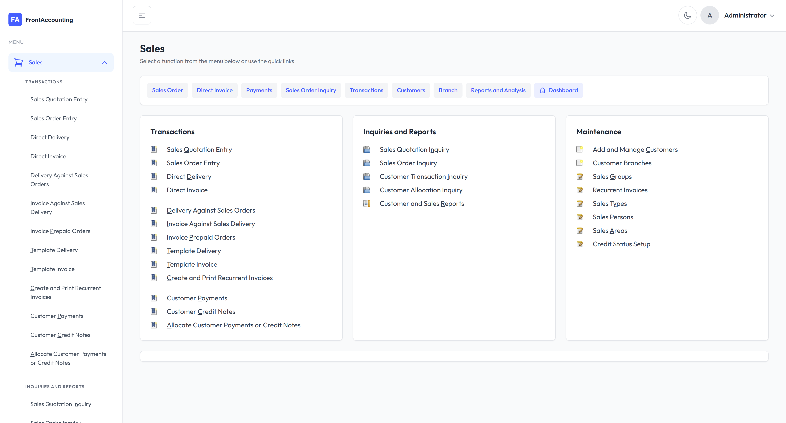
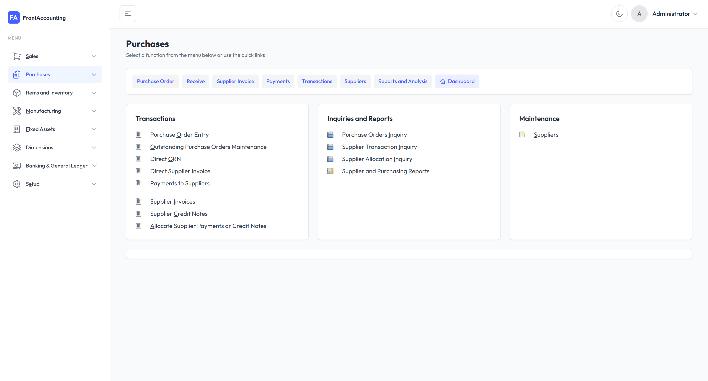
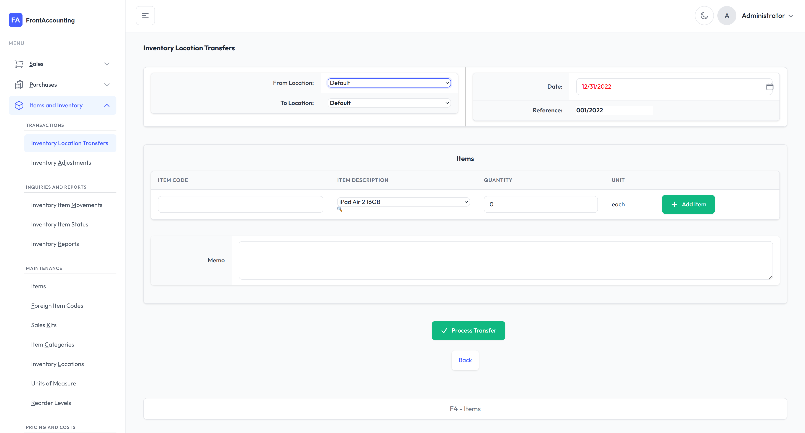
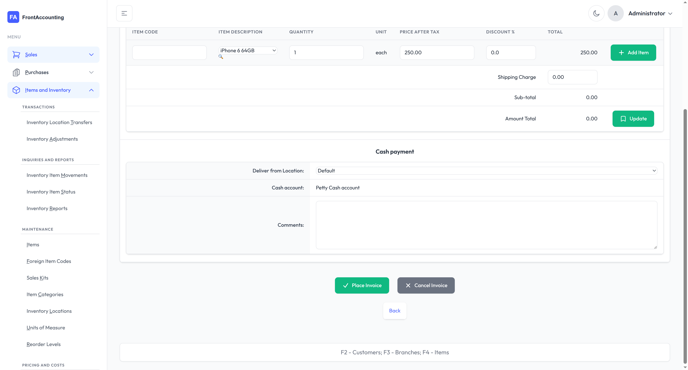
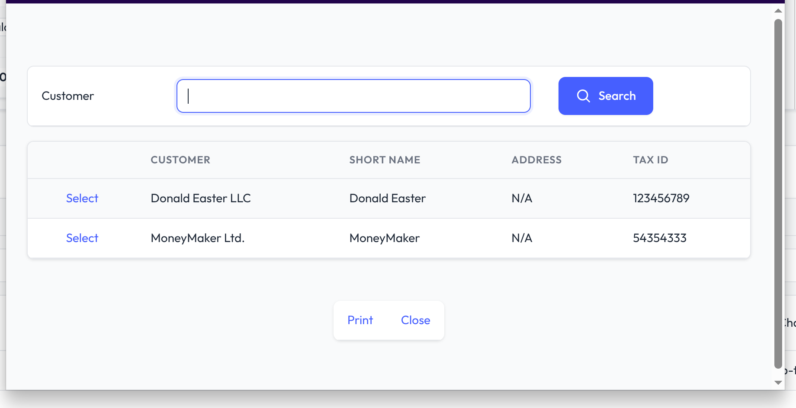
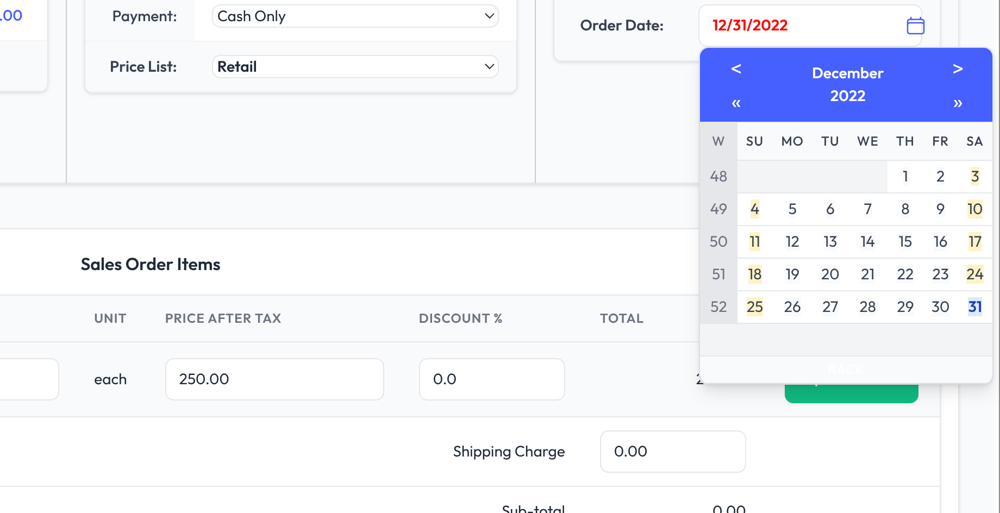

# TailAdmin Theme for FrontAccounting

A modern, responsive theme for [FrontAccounting](https://frontaccounting.com/) based on [TailAdmin](https://tailadmin.com/) design system.


## ✨ Features

- 🎨 **Modern Design** - Clean, professional UI based on TailAdmin
- 🌙 **Dark Mode** - Full dark mode support with smooth transitions
- 📱 **Responsive** - Mobile-friendly sidebar and layout
- 🎯 **Heroicons** - Beautiful SVG icons throughout
- ⚡ **Alpine.js** - Lightweight interactivity for menus and toggles
- 🎨 **Tailwind CSS** - Utility-first CSS framework
- 🔔 **Styled Alerts** - Beautiful error, warning, and info messages
- 📅 **Modern Date Picker** - Styled calendar with icon inside input
- 🔘 **Consistent Buttons** - Color-coded action buttons with icons
- 📋 **Module Grouping** - Sidebar menus organized by Transactions, Inquiries, Maintenance
- 🎯 **Quick Links** - Shortcuts bar on module main pages
- 🖱️ **Smart Navigation** - Click menu text to navigate, arrow to expand/collapse
- 🎴 **Card-based Layout** - Consistent card styling throughout
- 🔑 **Keyboard Shortcuts** - Styled keyboard shortcuts display

## 📸 Screenshots

### Module Pages

<div align="center">
  
  <p><em>Sales Module with Quick Links</em></p>
</div>

<div align="center">
  
  <p><em>Purchases Module Page</em></p>
</div>

<div align="center">
  
  <p><em>Inventory Module Page</em></p>
</div>

### Sales & Orders

<div align="center">
  
  <p><em>Sales Orders List</em></p>
</div>

<div align="center">
  
  <p><em>Sales Order Entry Form</em></p>
</div>

<div align="center">
  
  <p><em>Direct Sales Invoice</em></p>
</div>

### Reports & Search

<div align="center">
  
  <p><em>Inventory Reports</em></p>
</div>

<div align="center">
  
  <p><em>Customer Search</em></p>
</div>

### Forms & Inputs

<div align="center">
  
  <p><em>Date Picker with Icon Inside Input</em></p>
</div>

### Authentication

<div align="center">
  
  <p><em>Styled Login Page</em></p>
</div>

<div align="center">
  
  <p><em>User Menu & Logout</em></p>
</div>

## 📋 Requirements

- FrontAccounting 2.4.x or higher
- Modern web browser (Chrome, Firefox, Safari, Edge)

## 🚀 Installation

### Method 1: Download ZIP

1. Download the latest release from [Releases](https://github.com/wilocampo/frontaccounting-theme-tailadmin/releases)
2. Extract the `tailadmin` folder to your FrontAccounting `themes/` directory
3. Log in to FrontAccounting as administrator
4. Go to **Setup** → **User Preferences** or **Company Setup**
5. Select **tailadmin** from the Theme dropdown
6. Save changes

### Method 2: Git Clone

```bash
cd /path/to/frontaccounting/themes/
git clone https://github.com/wilocampo/frontaccounting-theme-tailadmin.git tailadmin
```

## 🔐 Login Page Configuration

By default, FrontAccounting's login page uses the "default" theme. To apply the TailAdmin theme to the login page, you need to modify the FrontAccounting core configuration:

### Step 1: Edit `config.php`

Open your FrontAccounting `config.php` file and add the following line:

```php
$dflt_theme = 'tailadmin';
```

This sets the default theme for the login page and password reset page.

### Step 2: Verify Core Files

The theme requires modifications to two core files to use the `$dflt_theme` variable:

1. **`access/login.php`** (around line 53-54):
   ```php
   global $SysPrefs;
   $def_theme = isset($SysPrefs->dflt_theme) ? $SysPrefs->dflt_theme : "default";
   ```

2. **`access/password_reset.php`** (around line 27-28):
   ```php
   global $SysPrefs;
   $def_theme = isset($SysPrefs->dflt_theme) ? $SysPrefs->dflt_theme : "default";
   ```

> **Note:** These modifications are required because FrontAccounting's login page doesn't use the theme hook system. The changes are minimal and only affect the theme selection logic.

### Alternative: Manual Theme Selection

If you prefer not to modify core files, users can still select the TailAdmin theme from their user preferences after logging in. The login page will continue to use the default theme.

## 📁 Directory Structure

```
tailadmin/
├── index.php           # Theme index (redirect)
├── renderer.php        # Main theme renderer
├── default.css         # Theme styles
├── images/
│   └── logo/          # Logo files
├── vendor/
│   ├── alpinejs/      # Alpine.js
│   ├── tailwindcss/   # Tailwind CSS
│   └── fonts/         # Outfit font
└── README.md
```

## 🎨 Customization

### Colors

The theme uses a consistent color palette. Main colors can be customized in `default.css`:

| Color | Variable | Default | Usage |
|-------|----------|---------|-------|
| Brand | `#465fff` | Blue | Primary actions, links |
| Success | `#10b981` | Green | Add, Save, Update buttons |
| Danger | `#ef4444` | Red | Delete, Remove buttons |
| Warning | `#f59e0b` | Amber | Warning alerts |
| Gray | `#6b7280` | Gray | Cancel buttons |

### Logo

Replace the logo files in `images/logo/`:
- `logo.svg` - Light mode logo
- `logo-dark.svg` - Dark mode logo
- `logo-icon.svg` - Collapsed sidebar icon

### Dark Mode

Dark mode is automatically detected from system preferences and can be toggled via the header button. The preference is saved to localStorage.

## 🎯 Sidebar Navigation

The sidebar features intelligent navigation:

- **Module Grouping**: Menu items are organized under headers (Transactions, Inquiries and Reports, Maintenance)
- **Smart Click Behavior**: 
  - Click on menu text/icon → Navigate to module main page
  - Click on arrow → Expand/collapse submenu
- **Active State Detection**: Automatically highlights active menu items and expands parent menus
- **Collapsible Sidebar**: Toggle sidebar on mobile or collapse to icons on desktop

## 🔧 Button Styling

Buttons are automatically styled based on their value/text:

| Button Text Contains | Color | Icon |
|---------------------|-------|------|
| Add | Green | Plus (+) |
| Update, Save | Green | Save |
| Place, Process, Submit, Confirm | Green | Checkmark |
| Cancel | Gray | X |
| Delete, Remove | Red | Trash |
| Search | Blue | Magnifying glass |

## 📄 Module Pages

Each module (Sales, Purchases, etc.) has a dedicated main page with:

- **Page Title**: Clear heading with module name
- **Quick Links Bar**: Shortcuts to common functions (e.g., "Sales Order", "Direct Invoice")
- **Module Cards**: Organized by function groups (Transactions, Inquiries, Maintenance)
- **Dashboard Link**: Quick access to module dashboard

## 📝 Alert Styles

FrontAccounting messages are styled as modern alerts:

- **Error** (`.err_msg`) - Red background with exclamation icon
- **Warning** (`.warn_msg`) - Amber background with warning icon
- **Notice** (`.note_msg`) - Blue background with info icon
- **Success** (`.success_msg`) - Green background with checkmark icon

## 📅 Date & Time Display

The date and time are displayed in the footer (matching other FrontAccounting themes), along with:
- FrontAccounting version and theme name
- Users online count
- Power by information

## ⌨️ Keyboard Shortcuts

Keyboard shortcuts are displayed in a styled card at the bottom of the main content area, matching the theme's card design for consistency.

## 🤝 Contributing

Contributions are welcome! Please feel free to submit a Pull Request.

1. Fork the repository
2. Create your feature branch (`git checkout -b feature/AmazingFeature`)
3. Commit your changes (`git commit -m 'Add some AmazingFeature'`)
4. Push to the branch (`git push origin feature/AmazingFeature`)
5. Open a Pull Request

## 📄 License

This theme is released under the [GNU General Public License v3.0](LICENSE), the same license as FrontAccounting.

## 🙏 Credits

- [FrontAccounting](https://frontaccounting.com/) - The ERP system
- [TailAdmin](https://tailadmin.com/) - Design inspiration and components
- [Tailwind CSS](https://tailwindcss.com/) - CSS framework
- [Alpine.js](https://alpinejs.dev/) - JavaScript framework
- [Heroicons](https://heroicons.com/) - SVG icons

## 📧 Support

- **FrontAccounting Issues**: [FrontAccounting Forum](https://frontaccounting.com/punbb/)
- **Theme Issues**: [GitHub Issues](https://github.com/wilocampo/frontaccounting-theme-tailadmin/issues)

---

Made with ❤️ for the FrontAccounting community
